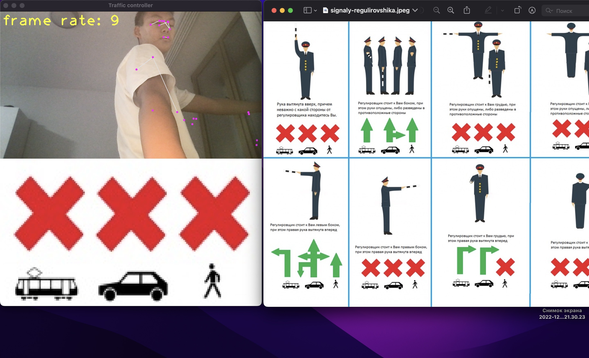
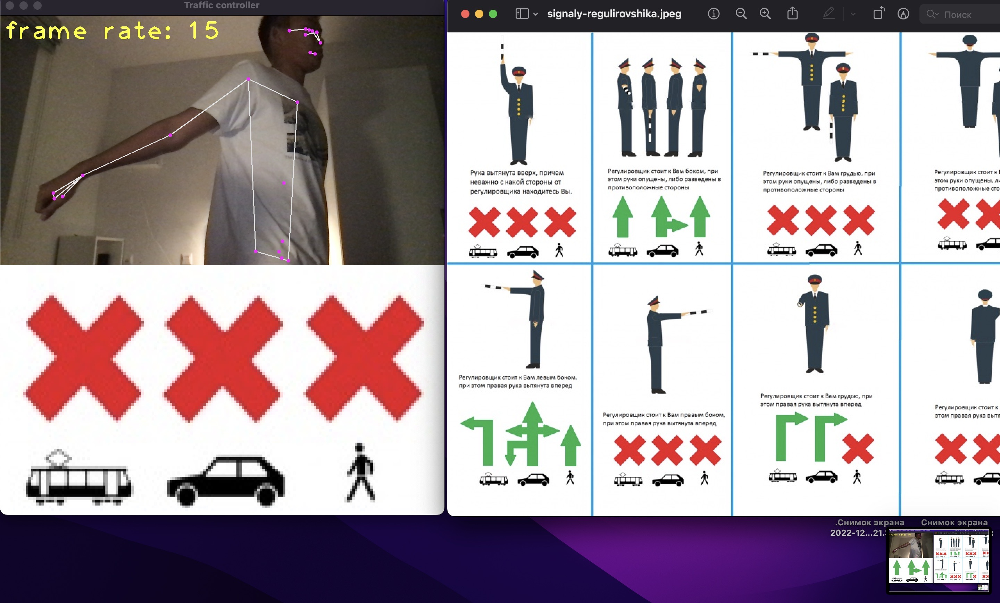
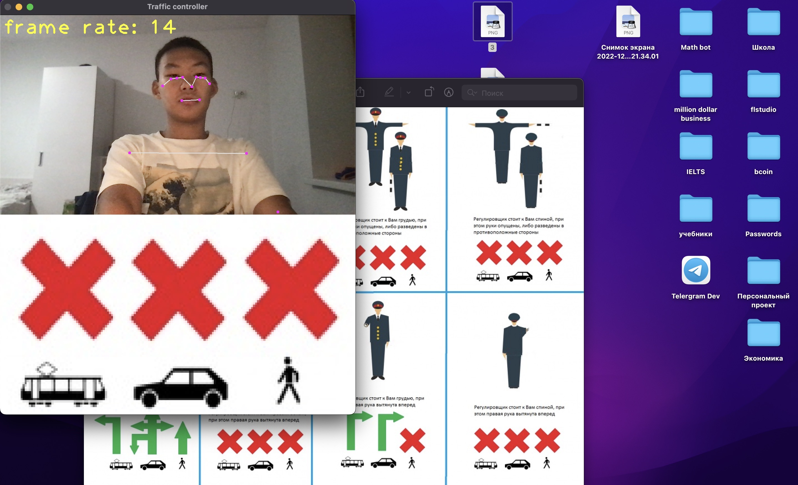

# Журнал

Идею я придумал сам. Я изучил жесты регулировщиков и решил, что мой проект может быть полезен, ведь немногие люди знают жесты регулировщиков.

Материал, которым я пользовался:

## Основной функционал программы
Я начал реализацию с обдумывания структуры. В проекте должен был быть класс, содержащий в себе методы, которыми можно отличать одни позы от других. Также должен быть файл с основным циклом, где проводится анализ позы и отображение нужной информации на экране. 

Я сделал конструктор класса и примерно обдумал, какие методы нужны для распознавания положения тела. Затем я написал часть основного цикла, пока без 

Потом я доработал класс и дописал основной цикл.

Возникли проблемы с распознаванием углов (оказалось, что углы в некоторых случаях считались против часовой стрелки, то есть их значения доходили до 290 градусов)

Например:

Ожидаемый результат:

Получившийся результат:

Но я пофиксил этот баг

В целом, весь функционал программы реализован. программа идентифицирует 4 различных случая, которые получаются при разных позах.

## Интерфейс

Интерфейс я решил написать на ткинтере

В первой версии кода я объединял две картинки np.concatenate(), но с ткинтером нету необходимости в этом, я переписал код и сделал так, чтобы 2 отдельные картинки размещались на canvas
Также я решил убрать фпс счетчик

Затем я добавил кнопку выхода

## Чистка кода

Далее я добавил README.md, почистил код, добавил комментарии

## Результат

Программа полностью соответствует заявленной задаче